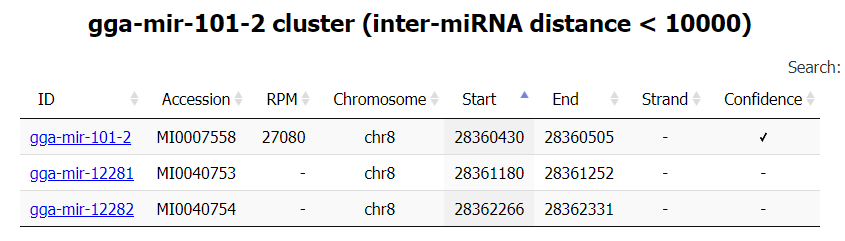

This cookbook demonstrates some use cases with example code which helps achieve presented tasks. Some of them might be done in multiple ways and also these alternative solutions are shown. We believe, that learning on examples is the most effective way of learning. To read about the use case, click on an arrow in the right side of particular box.
## The set up
Just before all of this, we need to make sure, that the package is imported and database object is created!
```python
from mirus import miBase

m = miBase.MiRBase()  # Reminder! Version can be specified here
```

## Working with organisms

### Retrieving all at once
Suppose a user wanted to find out all the details about all the organisms that are included in a particular version of the database. Mir-Us makes this possible with one simple function:
!!! example "Retrieving list of all organisms from database"
    ```python
    organisms = m.get_organisms_list()
    ```
If a user would like to see what has been retrieved, `organisms` object can be simply printed. The head of the output should look like this:
```
[Organism(organism='aqu', division='AQU', name='Amphimedon queenslandica', tree='Metazoa;Porifera;', taxid='400682'), Organism(organism='nve', division='NVE', name='Nematostella vectensis', tree='Metazoa;Cnidaria;', taxid='45351'), Organism(organism='h
ma', division='HMA', name='Hydra magnipapillata', tree='Metazoa;Cnidaria;', taxid='6085'), Organism(organism='sko', division='SKO', name='Saccoglossus kowalevskii', tree='Metazoa;Bilateria;Deuterostoma;Hemichordata;', taxid='10224'), Organism(organism=  
'spu', division='SPU', name='Strongylocentrotus purpuratus', tree='Metazoa;Bilateria;Deuterostoma;Echinodermata;', taxid='7668'), Organism(organism='cin', division='CIN', name='Ciona intestinalis', tree='Metazoa;Bilateria;Deuterostoma;Chordata;Urochord
ata;', taxid='7719'), Organism(organism='csa', division='CSA', name='Ciona savignyi', tree='Metazoa;Bilateria;Deuterostoma;Chordata;Urochordata;', taxid='51511'), Organism(organism='odi', division='ODI', name='Oikopleura dioica', tree='Metazoa;Bilateri
a;Deuterostoma;Chordata;Urochordata;', taxid='34765'), Organism(organism='bfl', division='BFL', name='Branchiostoma floridae', tree='Metazoa;Bilateria;Deuterostoma;Chordata;Cephalochordata;', taxid='7739')
...
```
Function `get_organisms_list` returns list of namedtuples which contains all available information about organisms from miRBase. Structure of namedtuple is following:
`Organism(organism='', division='', name='', tree='', taxid='')`

| Key          | Explanation                 |
| ------------ | --------------------------- |
| `organism`   | Organism name abbreviation. |
| `division`   | Organism name abbreviation. |
| `name`       | Full organism name in latin. |
| `tree`       | Full taxonomy path of the organism delimited by `;` |
| `taxid`      | NCBI taxonomy ID of the organism |

Accessing organism information is described in [Fetching certain organism](#fetching-certain-organisms).

### Fetching specific organisms
Suppose a user is tasked with getting all the information about a hen. To do this, the appropriate namedtuple can be referenced from the list obtained by the `get_organisms_list` function.
#### Using namedtuples from `get_organism_list()` function
!!! example "Retrieving a single Organism() namedtuple"
    ```python
    organisms = m.get_organisms_list()  
    gallus = [nt for nt in organisms if getattr(nt, "name") == "Gallus gallus"][0]
    ```
If `gallus` object is printed, all the data is shown:
```
Organism(organism='gga', division='GGA', name='Gallus gallus', tree='Metazoa;Bilateria;Deuterostoma;Chordata;Vertebrata;Aves;', taxid='9031')
```
As it may have been already noticed, the `getattr()` function allows to get information from a particular namedtuple:
!!! example "Acessing data in a single namedtuple"
    === "Code"
        ```python
        print(getattr(gallus, "organism"))
        print(getattr(gallus, "name"))
        print(getattr(gallus, "tree"))
        print(getattr(gallus, "taxid"))
        ```
    === "Result"
        ```
        'gga'
        'Gallus gallus'
        'Metazoa;Bilateria;Deuterostoma;Chordata;Vertebrata;Aves;'
        '9031'
        ```
#### Using `get_organism()` function
Using this function, only organism names can be retrieved. However, it is a much simpler function to use if taxonomy of an organism is known. But it must be kept in mind, this function returns all organisms from pointed taxonomy level (thus it is not that specific as previous way)
!!! example "Retrieving organisms from a given taxonomy level"
    === "Code"
        ```python
        print(m.get_organism("Aves", verbose=True))
        ```
    === "Result"
        ```
        [Mir-Us]  'get_organism' found 4 results in 0.006766 seconds
        ['Gallus gallus', 'Taeniopygia guttata', 'Columba livia', 'Anas platyrhynchos']
        ```

### Using organism abbreviations
#### get_organisms_short() function 
If one needs data of organism names and its abbreviations, they can be all fetched using `get_organisms_short()` function. This information can be also retrieved by `get_organisms_list()` function, but this is an alternative and a faster way to do this.
If abbreviation of organism name is know, full name can be retrieved as follows:     
!!! example "Retrieving organism name from organism abbreviation using get_organisms_short() function"
    === "Code"
        ```python
        shorts = m.get_organisms_short()
        gallus = shorts['gga']
        print(gallus)
        ```
    === "Result"
        ```
        'Gallus gallus'
        ```

With a bit more code, an abbreviation can be retrieved from a full name:
!!! example "Retrieving organism abbreviation from organism name using get_organisms_short() function"
    === "Code"
        ```python
        short_gal = list(shorts.keys())[list(shorts.values()).index("Gallus gallus")]
        print(short_gal)
        ```
    === "Result"
        ```
        'gga'
        ```
    
### Using NCBI taxonomy ID
If one needs data of organism names and its taxonomy ID, they can be all fetched using `get_taxid()` function. This information can be also retrieved by `get_organisms_list()` function, but this is an alternative and a faster way to do this.
If organism name is know, the taxonomy ID can be retrieved as follows:  
!!! example "Retrieving taxonomy ID from organism name using get_taxid() function"
    === "Code"
        ```python
        multiple_org = m.get_taxid(["Homo", "Chrysemys picta", "Amphimedon queenslandica"], verbose=True))
        single_org = m.get_taxid("Gallus gallus", verbose=True)
        print(multiple_org)
        print(single_org)
        print(single["Gallus gallus"])
        ```
    === "Result"
        ```
        [Mir-Us]  'get_taxid' found 2 results in 0.000128 seconds
        {'Chrysemys picta': '8479', 'Amphimedon queenslandica': '400682'}
        [Mir-Us]  'get_taxid' found 1 results in 0.000106 seconds
        {'Gallus gallus': '9031'}
        9031
        ```
!!! tip "If a list is an expected argument in the function, but you only search for a single, specific item, then you can just pass a string instead of a list."
First usage of the function is worth of mentioning, because:

- function can return taxonomy IDs for multiple organisms
- if incorrect organism name appears, it will be ignored

### Taxonomy
#### Using get_tax_level()
A possible situation is when one would need to easily get the taxonomic path of a given organism name. The perfect solution is to use `get_tax_level()` function which returns a list of all taxonomy level names affiliated with a given organism.
!!! example "Retrieving taxonomy path of organism name using get_tax_level() function"
    === "Code"
        ```python
        print(m.get_tax_level(['Homo', "Amphimedon queenslandica"], verbose=True))
        print(m.get_tax_level("Gallus gallus", verbose=True))
        ```
    === "Result"
        ```
        [Mir-Us]  'get_tax_level' found 1 results in 0.000279 seconds
        {'Amphimedon queenslandica': ['Metazoa', 'Porifera']}
        [Mir-Us]  'get_tax_level' found 1 results in 0.000234 seconds
        {'Gallus gallus': ['Metazoa', 'Bilateria', 'Deuterostoma', 'Chordata', 'Vertebrata', 'Aves']}
        ```
First usage of the function is, again, worth of mentioning, because:

- function can return taxonomy paths for multiple organisms
- if incorrect organism name appears, it will be ignored

#### Taxonomy tree
Organism names can be also retrieved from the taxonomy tree data structure which Mir-Us provide.

[Taxonomy tree details :octicons-link-16:](#specifics-of-the-taxonomy-tree){ .md-button .md-button--primary }
## Specifics of the taxonomy tree
Mir-Us provides a data structure which is a copy of the taxonomy tree available on ['Browse by species'](https://www.mirbase.org/cgi-bin/browse.pl) site from miRBase. Because of its characteristic impementation in Mir-Us, user is allowed to slice a part of tree from a pointed taxonomy level or retrieve only organism names from a certain taxonomy level.
### Structure of the tree
Structure of the tree is not complicated but it might be not intuitive at first. Bascially, the tree is defined as a dictionary of other dictionaries which are representing subsequent taxonomy levels. To better visualise it, we can think of this structure as a file system - in a directory there is another directory, which holds another directory. If certain taxonomy level has organisms in it, then we can think that there are some loose files in that particular directory.

We can graphically demonstrate the structure as mentioned files system:
```
.
├─ Alveolata/
│  └─ !organism/
│     └─ "Symbiodinium microadriaticum"
├─ Chromalveolata/
│  └─ Heterokontophyta/
│     └─ !organism/
│        └─ "Ectocarpus siliculosus",
│           "Phaeodactylum tricornutum",
│           "Phytophthora infestans",
│           "Phytophthora ramorum",
│           "Phytophthora sojae"
...
```
And this is how the taxonomy tree structure from Mir-Us looks like:
!!! example "Fetching taxonomy tree using get_tree() function"
    === "Code"
        ```python
        m.get_tree()
        ```
    === "Result"
        ```
        {
            "Alveolata": {
                "!organism": [
                    "Symbiodinium microadriaticum"
                ]
            },
            "Chromalveolata": {
                "Heterokontophyta": {
                    "!organism": [
                        "Ectocarpus siliculosus",
                        "Phaeodactylum tricornutum",
                        "Phytophthora infestans",
                        "Phytophthora ramorum",
                        "Phytophthora sojae"
                    ]
                }
            },
        ...
        ```
### Accessing the tree
Using positional argument `tax_path` of the `get_tree()` function enables to slice the tree structure and retrieve only specified fragment of the tree structure.

Gallus gallus belongs to the Vertebrata subphylum but we would like to know what other organisms of this subphylum are present in the database. Slicing tree by the Vertebrata subphylum looks as following:
!!! example "Slicing taxonomy tree using get_tree() function with the usage of tax_path parameter"
    === "Code"
        ```python
        tree = m.get_tree(["Metazoa", "Bilateria", "Deuterostoma", "Chordata", "Vertebrata"], verbose=True)
        ```
    === "Result"
        ```
        {
            "Agnathostomata": {
                "!organism": [
                    "Petromyzon marinus"
                ]
            },
            "Amphibia": {
                "!organism": [
                    "Xenopus laevis",
                    "Xenopus tropicalis"
                ]
            },
            "Aves": {
                "!organism": [
                    "Anas platyrhynchos",
                    "Columba livia",
                    "Gallus gallus",
                    "Taeniopygia guttata"
                ]
            },
            "Gnathostomata": {
                "!organism": [
                    "Callorhinchus milii"
                ]
            },
            "Mammalia": {
                "Afrotheria": {
                    "!organism": [
                        "Echinops telfairi"
                    ]
                },
                "Carnivora": {
                    "!organism": [
                        "Canis familiaris"
                    ]
                },
                "Cingulata": {
                    "!organism": [
                        "Dasypus novemcinctus"
                    ]
                },
                "Lagomorpha": {
                    "!organism": [
                        "Oryctolagus cuniculus"
                    ]
                },
                "Laurasiatheria": {
                    "!organism": [
                        "Artibeus jamaicensis",
                        "Bubalus bubalis",
                        "Eptesicus fuscus",
                        "Equus caballus",
                        "Pteropus alecto"
                    ]
                },
                "Metatheria": {
                    "!organism": [
                        "Macropus eugenii",
                        "Monodelphis domestica",
                        "Sarcophilus harrisii"
                    ]
                },
                "Primates": {
                    "Atelidae": {
                        "!organism": [
                            "Ateles geoffroyi",
                            "Lagothrix lagotricha"
                        ]
                    },
                    "Cebidae": {
                        "!organism": [
                            "Callithrix jacchus",
                            "Saguinus labiatus",
                            "Saimiri boliviensis"
                        ]
                    },
                    "Cercopithecidae": {
                        "!organism": [
                            "Macaca mulatta",
                            "Macaca nemestrina",
                            "Papio hamadryas",
                            "Pygathrix bieti"
                        ]
                    },
                    "Cheirogaleidae": {
                        "!organism": [
                            "Microcebus murinus"
                        ]
                    },
                    "Daubentoniidae": {
                        "!organism": [
                            "Daubentonia madagascariensis"
                        ]
                    },
                    "Galagidae": {
                        "!organism": [
                            "Otolemur garnettii"
                        ]
                    },
                    "Hominidae": {
                        "!organism": [
                            "Gorilla gorilla",
                            "Homo sapiens",
                            "Pan paniscus",
                            "Pan troglodytes",
                            "Pongo pygmaeus",
                            "Symphalangus syndactylus"
                        ]
                    },
                    "Hylobatidae": {
                        "!organism": [
                            "Nomascus leucogenys"
                        ]
                    },
                    "Lemuridae": {
                        "!organism": [
                            "Lemur catta"
                        ]
                    }
                },
                "Prototheria": {
                    "!organism": [
                        "Ornithorhynchus anatinus"
                    ]
                },
                "Rodentia": {
                    "!organism": [
                        "Cavia porcellus",
                        "Cricetulus griseus",
                        "Mus musculus",
                        "Rattus norvegicus"
                    ]
                },
                "Ruminantia": {
                    "!organism": [
                        "Bos taurus",
                        "Capra hircus",
                        "Ovis aries"
                    ]
                },
                "Scandentia": {
                    "!organism": [
                        "Tupaia chinensis"
                    ]
                },
                "Suina": {
                    "!organism": [
                        "Sus scrofa"
                    ]
                }
            },
            "Sauria": {
                "!organism": [
                    "Alligator mississippiensis",
                    "Anolis carolinensis",
                    "Chrysemys picta",
                    "Ophiophagus hannah",
                    "Python bivittatus"
                ]
            },
            "Teleostei": {
                "!organism": [
                    "Astatotilapia burtoni",
                    "Carassius auratus",
                    "Cyprinus carpio",
                    "Danio rerio",
                    "Electrophorus electricus",
                    "Fugu rubripes",
                    "Gadus morhua",
                    "Hippoglossus hippoglossus",
                    "Ictalurus punctatus",
                    "Metriaclima zebra",
                    "Neolamprologus brichardi",
                    "Nothobranchius furzeri",
                    "Oncorhynchus mykiss",
                    "Oreochromis niloticus",
                    "Oryzias latipes",
                    "Paralichthys olivaceus",
                    "Pundamilia nyererei",
                    "Salmo salar",
                    "Tetraodon nigroviridis"
                ]
            }
        }
        [Mir-Us]  'get_tree' found 1 results in 0.004225 seconds
        ```

If we are intrested in the Aves class, then it is possible to retrieve all organism names in the list from the tree structure:
!!! example "Retrieving organism names from a certain part of the taxonomy tree structure (from the Aves class) using get_tree() function and tax_path parameter"
    === "Code"
        ```python
        # using previous tree slice
        print(tree["Aves"]["!organism"])

        # direct slice to Aves and retrieving organisms
        aves = m.get_tree(["Metazoa", "Bilateria", "Deuterostoma", "Chordata", "Vertebrata", "Aves"], verbose=True)["!organism"]
        print(aves)
        ```
    === "Result"
        ```
        ['Anas platyrhynchos', 'Columba livia', 'Gallus gallus', 'Taeniopygia guttata']
        {
            "!organism": [
                "Anas platyrhynchos",
                "Columba livia",
                "Gallus gallus",
                "Taeniopygia guttata"
            ]
        }
        [Mir-Us]  'get_tree' found 1 results in 0.001367 seconds
        ['Anas platyrhynchos', 'Columba livia', 'Gallus gallus', 'Taeniopygia guttata']
        ```
!!! warning "A tree structure slicing should not be mistaken with accessing data of particular taxonomy level. Through `get_tree()` function it is possible to show the whole tree or its specified part and then return its structure as a dictionary. To retrieve organisms list from a particular taxonomy level of a tree structure, a returned structure must be accessed, so it cannot be done in the function itself (through `tax_path` parameter)."
## Fetching mature miRNA
In the previous paragraphs, Gallus gallus was the main object of the research. It will be no different this time, because we will retrieve all miRNAs from Gallus gallus and we will subsequently narrow the search.
### Searching by organism name
Firstly, we would like to retrieve all miRNAs from Gallus gallus. This can be done using `get_mirna()` function.
!!! example "Retrieving all miRNAs from Gallus gallus using get_mirna() function"
    === "Code"
        ```python
        gallus_mirna = m.get_mirna(organism_name="Gallus gallus", verbose=True)
        ```
    === "Result"
        ```
        [Mir-Us]  'get_mirna' found 1235 results in 0.052002 seconds
        ```
### Genomic search
As it turned out, we have to narrow down the search. Let's say we have been given some instructions that specifies some genomic features:

- chromosme 8 must be searched
- results must be from the minus strand
- search must be conducted from 6000000th nucleotide upstream

!!! example "Retrieving all miRNAs from Gallus gallus with regard of genomic features (chromosome 8, minus strand, 6000000th nucleotide upstream search)"
    === "Code"
        ```python
        gallus_mirna = m.get_mirna(organism_name="Gallus gallus", chr="chr8", strand="-", start="6000000", verbose=True)
        print(gallus_mirna)
        ```
    === "Result"
        ```
        [Mir-Us]  'get_mirna' found 16 results in 0.041173 seconds
        [
                Mature ID: MIMAT0001185
                Mature name: gga-miR-101-3p
                Derivative: MI0001270, MI0007558
                Mature sequence: guacaguacugugauaacugaa, guacaguacugugauaacugaa
                Mature positions: ('48', '69'), ('48', '69')
                Organism: Gallus gallus
                Evidence: experimental, experimental
                Experiment: cloned [1], Illumina [2-3], cloned [1], Illumina [2-3]
                End: 3p, 3p
                Chromosome: chr8, chrZ
                Genome coordinates: {'MI0001270': [('27510701', '27510722')],
         'MI0007558': [('28360437', '28360458')]}
                Strand: -, +
                References: 18256158, 18469162, 23034410
        ,
                Mature ID: MIMAT0007451
        ...
        ```
Results were narrowed down to just 16 records.

There is one thing worth mentioning - specifying a feature from a certain category (e.g. chromosome) does not mean, that returned record will be affiliated only with that specified feature. For example, the returned record in the 'Results' tab fulfills search criteria but additionally has a connection with chromosome Z, which was not requested.

Also, there is much more types of features which can be used to search the records. Button below provides more information about this topic.

[get_mirna documentation :octicons-link-16:](miBase.md#miBase.MiRBase.get_mirna){ .md-button .md-button--primary }

### Accessing specific records
To access a specific record or records, a `get_mirna()` function with `mirna_id` flag should be used to retrieve them. Suppose, we would like to access only that sample record from 'Results' tab from previous paragraph.
!!! example "Retrieving a single miRNA using get_mirna() function"
    === "Code"
        ```python
        sample_gallus = m.get_mirna(mirna_id="MIMAT0001185", verbose=True)
        print(sample_gallus)
        ```
    === "Result"
        ```
        [Mir-Us]  'get_mirna' found 1 results in 0.000011 seconds
        [
                Mature ID: MIMAT0001185
                Mature name: gga-miR-101-3p
                Derivative: MI0001270, MI0007558
                Mature sequence: guacaguacugugauaacugaa, guacaguacugugauaacugaa
                Mature positions: ('48', '69'), ('48', '69')
                Organism: Gallus gallus
                Evidence: experimental, experimental
                Experiment: cloned [1], Illumina [2-3], cloned [1], Illumina [2-3]
                End: 3p, 3p
                Chromosome: chr8, chrZ
                Genome coordinates: {'MI0001270': [('27510701', '27510722')],
         'MI0007558': [('28360437', '28360458')]}
                Strand: -, +
                References: 18256158, 18469162, 23034410
        ]
        ```
Retrieving a list of specific records is also possible and it's very intuitive (just pass a list of IDs to a function).
!!! example "Retrieving a multiple miRNA using get_mirna() function"
    === "Code"
        ```python
        sample_gallus = m.get_mirna(mirna_id=["MIMAT0001185", "MIMAT0025825", "MIMAT0007451"], verbose=True)
        print(sample_gallus)
        ```
    === "Result"
        ```
        [Mir-Us]  'get_mirna' found 3 results in 0.000023 seconds
        [
                Mature ID: MIMAT0001185
                Mature name: gga-miR-101-3p
                Derivative: MI0001270, MI0007558
                Mature sequence: guacaguacugugauaacugaa, guacaguacugugauaacugaa
                Mature positions: ('48', '69'), ('48', '69')
                Organism: Gallus gallus
                Evidence: experimental, experimental
                Experiment: cloned [1], Illumina [2-3], cloned [1], Illumina [2-3]
                End: 3p, 3p
                Chromosome: chr8, chrZ
                Genome coordinates: {'MI0001270': [('27510701', '27510722')],
         'MI0007558': [('28360437', '28360458')]}
                Strand: -, +
                References: 18256158, 18469162, 23034410
        ,
                Mature ID: MIMAT0025825
                Mature name: gga-miR-6622-3p
                Derivative: MI0022537
                Mature sequence: uguggggacauuucuguggcauu
                Mature positions: ('69', '91')
                Organism: Gallus gallus
                Evidence: experimental
                Experiment: Illumina [1]
                End: 3p
                Chromosome: chr8
                Genome coordinates: {'MI0022537': [('22245960', '22245982')]}
                Strand: -
                References: 22418847
        ,
                Mature ID: MIMAT0007451
                Mature name: gga-miR-1589
                Derivative: MI0007316
                Mature sequence: cagccucugcugaucgucuuuu
                Mature positions: ('45', '66')
                Organism: Gallus gallus
                Evidence: experimental
                Experiment: Illumina [1]
                End: -
                Chromosome: chr8
                Genome coordinates: {'MI0007316': [('16516625', '16516646')]}
                Strand: -
                References: 18469162
        ]
        ```
Then, we can actually access the data from the MiRNA object. Let's say we will extract chromosome name and genome coordinates.
!!! example "Retrieving data from a single MiRNA object"
    === "Code"
        ```python
        print(sample_gallus[0].chromosome_mi)
        print(dict(sample_gallus[0].genome_coordinates_mi))
        ```
    === "Result"
        ```
        ['chr8', 'chrZ']
        {'MI0007558': [('28360437', '28360458')], 'MI0001270': [('27510701', '27510722')]}
        ```
!!! tip "Genome coordinates are of `defaultdict` type, thus conversion to dictionary might be necessary, depending of user needs."
Button below provides more detail about the data that is possible to be accessed.

[MiRNA object details :octicons-link-16:](miObject.md#mirna){ .md-button .md-button--primary }

## Fetching precursors
This paragraph is actually a copy of the previous one, because functions `get_mirna()` and `get_precursor()` are very similar. We will retrieve all precursors from Gallus gallus and we will subsequently narrow the search.
### Searching by organism name
Firstly, we would like to retrieve all precursors from Gallus gallus. This can be done using `get_precursor()` function.
!!! example "Retrieving all precursors from Gallus gallus using get_precursor() function"
    === "Code"
        ```python
        gallus_prec = m.get_precursor(organism_name="Gallus gallus", verbose=True)
        ```
    === "Result"
        ```
        [Mir-Us]  'get_precursor' found 882 results in 0.022170 seconds
        ```
### Genomic search
As it turned out, we have to narrow down the search. Let's say we have been given some instructions that specifies some genomic features:

- chromosme 8 must be searched
- results must be from the minus strand
- search must be conducted from 6000000th nucleotide upstream

!!! example "Retrieving all precursors from Gallus gallus with regard of genomic features (chromosome 8, minus strand, 6000000th nucleotide upstream search)"
    === "Code"
        ```python
        gallus_prec = m.get_precursor(organism_name="Gallus gallus", chr="chr8", strand="-", start="6000000", verbose=True)
        print(gallus_prec)
        ```
    === "Result"
        ```
        [Mir-Us]  'get_precursor' found 13 results in 0.022590 seconds
        [
                Precursor ID: MI0007316
                Precursor name: gga-mir-1589
                MiRNAs: MIMAT0007451
                Precursor structure: ((((..((..((((((((..((.(.(((((((...(((....))).)))))))).))..))))))))....))..))))
                Precursor sequence:  gcagugugcagagaggacacucugacagaggcaccgcugcccagcagccucugcugaucgucuuuuccuuccaaucugc
                Organism: Gallus gallus
                Taxonomy: Metazoa/Bilateria/Deuterostoma/Chordata/Vertebrata/Aves
                Chromosome: chr8
                Genome coordinates (start, end): ('16516612', '16516690')
                Strand: -
                High confidence: False
                References: 18469162
        ,
                Precursor ID: MI0007322
        ...
        ```
Results were narrowed down to just 13 records.

There is much more types of features which can be used to search the records. Button below provides more information about this topic.

[get_precursor documentation :octicons-link-16:](miBase.md#miBase.MiRBase.get_precursor){ .md-button .md-button--primary }

### Accessing specific records
To access a specific record or records, a `get_precursor()` function with `prec_id` flag should be used to retrieve them. Suppose, we would like to access only that sample record from 'Results' tab from previous paragraph.
!!! example "Retrieving a single precursor using get_precursor() function"
    === "Code"
        ```python
        sample_gallus = m.get_precursor(prec_id="MI0007316", verbose=True)
        print(sample_gallus)
        ```
    === "Result"
        ```
        [Mir-Us]  'get_precursor' found 1 results in 0.000012 seconds
        [
                Precursor ID: MI0007316
                Precursor name: gga-mir-1589
                MiRNAs: MIMAT0007451
                Precursor structure: ((((..((..((((((((..((.(.(((((((...(((....))).)))))))).))..))))))))....))..))))
                Precursor sequence:  gcagugugcagagaggacacucugacagaggcaccgcugcccagcagccucugcugaucgucuuuuccuuccaaucugc
                Organism: Gallus gallus
                Taxonomy: Metazoa/Bilateria/Deuterostoma/Chordata/Vertebrata/Aves
                Chromosome: chr8
                Genome coordinates (start, end): ('16516612', '16516690')
                Strand: -
                High confidence: False
                References: 18469162
        ]
        ```
Retrieving a list of specific records is also possible and it's very intuitive (just pass a list of IDs to a function).
!!! example "Retrieving a multiple precursors using get_precursor() function"
    === "Code"
        ```python
        sample_gallus = m.get_precursor(prec_id=["MI0007316", "MI0022537", "MI0007409"], verbose=True)
        print(sample_gallus)
        ```
    === "Result"
        ```
        [Mir-Us]  'get_precursor' found 3 results in 0.000012 seconds
        [
                Precursor ID: MI0007316
                Precursor name: gga-mir-1589
                MiRNAs: MIMAT0007451
                Precursor structure: ((((..((..((((((((..((.(.(((((((...(((....))).)))))))).))..))))))))....))..))))
                Precursor sequence:  gcagugugcagagaggacacucugacagaggcaccgcugcccagcagccucugcugaucgucuuuuccuuccaaucugc
                Organism: Gallus gallus
                Taxonomy: Metazoa/Bilateria/Deuterostoma/Chordata/Vertebrata/Aves
                Chromosome: chr8
                Genome coordinates (start, end): ('16516612', '16516690')
                Strand: -
                High confidence: False
                References: 18469162
        ,
                Precursor ID: MI0022537
                Precursor name: gga-mir-6622
                MiRNAs: MIMAT0025825
                Precursor structure: ................................(((.(((((.((((((.(((((.(......)))))).))))))...))))).))).......................
                Precursor sequence:  agggcuggagggagacagcagccaaauuccauccagaggaagucccacugacugagaaaggcccagucuguggggacauuucuguggcauuuugaggguaaaauggcuaa
                Organism: Gallus gallus
                Taxonomy: Metazoa/Bilateria/Deuterostoma/Chordata/Vertebrata/Aves
                Chromosome: chr8
                Genome coordinates (start, end): ('22245941', '22246050')
                Strand: -
                High confidence: False
                References: 22418847
        ,
                Precursor ID: MI0007409
                Precursor name: gga-mir-1675
                MiRNAs: MIMAT0007559
                Precursor structure: (((((.((((((((((..(((((((((((((..((((((.((((....)))).))))))..)))))..))))).)))..)))..)))).)))..))).))
                Precursor sequence:  gccuucccgcuuggccccgcucccgcucagggcggugucaggcggcgccgccggacgccaucuugacugugggcagcucggcuucaggucggcagagagc
                Organism: Gallus gallus
                Taxonomy: Metazoa/Bilateria/Deuterostoma/Chordata/Vertebrata/Aves
                Chromosome: chr8
                Genome coordinates (start, end): ('24727666', '24727765')
                Strand: -
                High confidence: False
                References: 18469162
        ]
        ```
Then, we can actually access the data from the Precursor object. Let's say we will extract chromosome name and genome coordinates.
!!! example "Retrieving data from a single Precursor object"
    === "Code"
        ```python
        print(sample_gallus[0].chromosome)
        print(sample_gallus[0].genome_coordinates)
        ```
    === "Result"
        ```
        ['chr8']
        [('16516612', '16516690')]
        ```

Button below provides more detail about the data that is possible to be accessed.

[Precursor object details :octicons-link-16:](miObject.md#precursor){ .md-button .md-button--primary }

## Fetching structures
One of the most problematic aspect of miRBase is precursor's structure notation. Obviously, it is a very informative notation but at the same time not standarised and very hard to parse for further usage. Mir-Us solves this problem, because every structure here is rewritten in dot-bracket format, which is a well know, standarised notation for RNA structures.
### Using get_structure() function
Suppose, we would like to retrieve all the precursor's structures of the affiliated miRNA that were retrieved in the 'Fetching mature miRNA' paragraph. We can use list comprehension to easily use previously fetched data (MiRNA objects). Comprehension itself consist of two for loops - one is to iterate through the MiRNA objects and the second one is to iterate through all precursor IDs stored in the object.
!!! example "Retrieving structures using get_structure() function"
    === "Code"
        ```python
        sample_gallus = m.get_mirna(mirna_id=["MIMAT0001185", "MIMAT0025825", "MIMAT0007451"], verbose=True)
        struct_gallus = m.get_structure(id=[precursor for mi_obj in sample_gallus for precursor in mi_obj.precursor], verbose=True)
        print(struct_gallus)
        ```
    === "Result"
        ```
        {'MI0001270': '((((((.((((((((((((((((((((..(((((............))))).)))))))))))))))))))).))))))', 'MI0007558': '(((..(((...((((((((((((((((((.((((..(....)....)))))))))))))))))))))))))..)))',
        'MI0022537': '................................(((.(((((.((((((.(((((.(......)))))).))))))...))))).))).......................', 'MI0007316': '((((..((..((((((((..((.(.(((((((...(((....))).)))))))).))..))))))))....))..))))'}
        ```
Naturally, function can also receive single ID string as an argument. Furthermore, to retrieve the structures one can also use the precursor names.

Retrieved structures in dot-bracket format can be directly used to visualise those structures in external tools such as [TBI-forna](http://rna.tbi.univie.ac.at/forna/)
## Fetching references
Fetching references is very straightforward using Mir-Us. With usage of the dedicated function (`get_references()`), one can retrieve all affiliated references with particular MiRNA or Precursor object.
### Using get_structures() function
We will once again use the retrieved MiRNA objects in order to fetch affiliated references. This process will be analogous to which was presented in the previous paragraph (about structures).  
!!! example "Retrieving references using get_references() function"
    === "Code"
        ```python
        sample_gallus = m.get_mirna(mirna_id=["MIMAT0001185", "MIMAT0025825", "MIMAT0007451"], verbose=True)
        print(sample_gallus)
        ref_gallus = m.get_references(mirna_id=[id for mi_obj in sample_gallus for id in mi_obj.mature_ID], verbose=True)
        print(ref_gallus)
        ```
    === "Result"
        ```
        [Mir-Us]  'get_references' found 4 results in 0.000007 seconds
        ['18256158', '18469162', '23034410', '22418847']
        ```
References are PubMed accession numbers that have to be put into a website link to be useful. Mir-Us provides here some quality of life improvements - `get_references()` can return links to PubMed instead of plain PubMed accession numbers so this functionality can save up some time in ones' workflow.  
!!! example "Retrieving links to PubMed using get_references() function"
    === "Code"
        ```python
        ref_gallus = m.get_references(mirna_id=[id for mi_obj in sample_gallus for id in mi_obj.mature_ID], link=True, verbose=True)
        print(ref_gallus)
        ```
    === "Result"
        ```
        [Mir-Us]  'get_references' found 4 results in 0.000011 seconds
        ['https://pubmed.ncbi.nlm.nih.gov/22418847/', 'https://pubmed.ncbi.nlm.nih.gov/23034410/', 'https://pubmed.ncbi.nlm.nih.gov/18256158/', 'https://pubmed.ncbi.nlm.nih.gov/18469162/']
        ```
Naturally, function can also receive single mature miRNA or precursor ID string as an argument. Furthermore, to retrieve the structures one can also use the mature miRNA names.

## Searching clusters
Mir-Us also provides cluster searching which is a true copy of a functionality (or rather information) that is present in the precursor records from miRBase. If one would like to know which miRNAs can be clustered, then a function `find_cluster()` should be used.

Cluster searching is pretty straightforward - to a give mature miRNA or precursor ID, the function searches through genomic space of the chromosome from an organism in which given ID is present and returns all precursor records which are found in the given range. The search can be conducted upstream, downstream or in both directions. Button below provides detailed description about this function.

[find_cluster() details :octicons-link-16:](miBase.md#miBase.MiRBase.find_cluster){ .md-button .md-button--primary }

For example, we would like to find a cluster for one of the Gallus gallus' (obviously) precursor in the range of 10000 nucleotides and both up and downstream from the given precursor. It turns out, that search parameters are the same as they are on miRBase by default.

For reference, in the 'miRBase result' tab there are results from miRBase

!!! example "Finding cluster using find_cluster() function"
    === "Code"
        ```python
        cluster_gallus = m.find_cluster(prec_id="MI0007558", range="10000", verbose=True)
        print(cluster_gallus)
        ```
    === "Result"
        ```
        [Mir-Us]  'find_cluster' found 3 results in 0.017245 seconds
        [
                Precursor ID: MI0007558
                Precursor name: gga-mir-101-2
                MiRNAs: MIMAT0031077, MIMAT0001185
                Precursor structure: (((..(((...((((((((((((((((((.((((..(....)....)))))))))))))))))))))))))..)))
                Precursor sequence:  gcugcccuggcucaguuaucacagugcugaugcugucucuuguaaagguacaguacugugauaacugaaggauggc
                Organism: Gallus gallus
                Taxonomy: Metazoa/Bilateria/Deuterostoma/Chordata/Vertebrata/Aves
                Chromosome: chr8
                Genome coordinates (start, end): ('28360430', '28360505')
                Strand: -
                High confidence: True
                References: 18256158, 18469162, 23034410
        ,
                Precursor ID: MI0040753
                Precursor name: gga-mir-12281
                MiRNAs: MIMAT0050064
                Precursor structure: ....((.((((((((((..((((((...((((.....))))....)))))).......))))))..)))).))
                Precursor sequence:  uauuccagcuggggucucucagcacagcuggcugcucgccguucggugcugcuccgucagacccaucagcagg
                Organism: Gallus gallus
                Taxonomy: Metazoa/Bilateria/Deuterostoma/Chordata/Vertebrata/Aves
                Chromosome: chr8
                Genome coordinates (start, end): ('28361180', '28361252')
                Strand: -
                High confidence: False
                References: 29079676
        ,
                Precursor ID: MI0040754
                Precursor name: gga-mir-12282
                MiRNAs: MIMAT0050065, MIMAT0050066
                Precursor structure: .((((..(((..(((((((((((((........))))))........))))))).))).))))...
                Precursor sequence:  ugccggggcgcuggggaggggcagcuccccuuugcugcccugcuucuccucccuucgcacggcgca
                Organism: Gallus gallus
                Taxonomy: Metazoa/Bilateria/Deuterostoma/Chordata/Vertebrata/Aves
                Chromosome: chr8
                Genome coordinates (start, end): ('28362266', '28362331')
                Strand: -
                High confidence: False
                References: 29079676
        ]
        ```
    === "miRBase result"

        